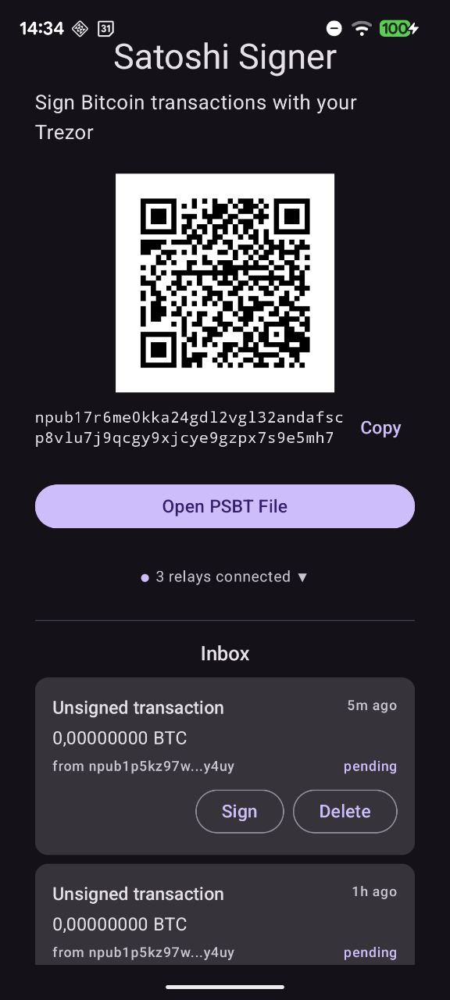
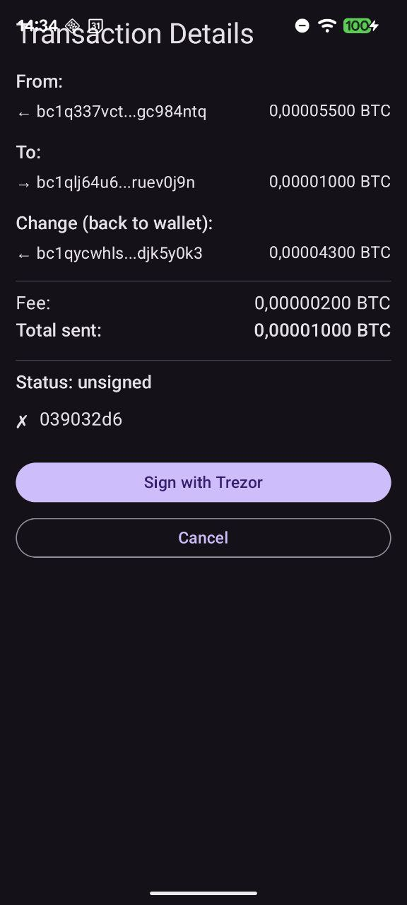
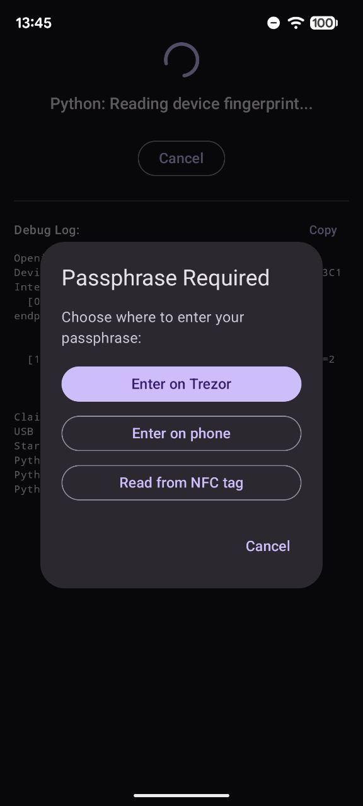

<p align="center">
  
</p>

# Satoshi Signer

An Android app that imports unsigned Bitcoin PSBTs (Partially Signed Bitcoin Transactions) — via file picker, Nostr relay, or clipboard — signs them with a Trezor hardware wallet connected via USB-C (with passphrase entry on-device, on-phone, or via NFC tag), and broadcasts the signed transaction to the Bitcoin network.

## Screenshots

<p align="center">
  
  &nbsp;&nbsp;
  
  &nbsp;&nbsp;
  
</p>

## Why

Electrum requires a desktop computer to interact with hardware wallets. No existing Android app supports the full workflow of importing external PSBTs and signing them with a Trezor via USB. Satoshi Signer fills this gap — create unsigned transactions in Electrum on a remote machine, transfer the PSBT file to your phone, sign with Trezor, and broadcast. No laptop needed.

## Workflow

1. Create unsigned transaction in Electrum on a remote machine
2. Send the PSBT to your phone:
   - **Via Nostr** — click "Send to Signer" in Electrum (requires the [Nostr Signer plugin](#electrum-plugin-nostr-signer))
   - **Via file** — send the `.psbt` file by email, cloud storage, messenger, etc.
3. Open the PSBT in Satoshi Signer (from inbox or file picker)
4. Review transaction details: destinations, change outputs, fee, multisig status
5. Connect Trezor via USB-C OTG cable
6. Sign on the Trezor
7. Broadcast to the Bitcoin network (or export updated PSBT for multisig)

## Features

- **Single-sig and multisig** PSBT support (P2WPKH, P2SH-P2WPKH, P2TR, P2WSH)
- **Change output detection** via BIP32 derivation path matching
- **OP_RETURN display** — shows embedded text (e.g. memos) in the transaction preview
- **Multisig status tracking** — shows which signers have signed (by fingerprint)
- **Transaction broadcasting** to mempool.space / blockstream.info with retry and fallback
- **Mempool links** — tap any address or txid to view it on mempool.space (auto-detects mainnet/testnet)
- **Manual broadcast fallback** — copy raw hex if API broadcast fails
- **PSBT export** for partially-signed multisig transactions (via Android share sheet)
- **Intent filter** — open `.psbt` files directly from file managers and email apps
- **Nostr PSBT delivery** — receive PSBTs from Electrum over Nostr relays (NIP-04 encrypted). No file transfer needed — just click "Send to Signer" in Electrum. See [Electrum Plugin](#electrum-plugin-nostr-signer) below.
- **NFC passphrase import** — tap a YubiKey or NDEF tag to enter your Trezor passphrase instead of typing it on the phone keyboard. Optional — the NFC option only appears on devices with NFC hardware.

## Architecture

```
Kotlin/Jetpack Compose (thin shell)     Python backend (via Chaquopy)
┌──────────────────────────┐            ┌──────────────────────────┐
│ UI Screens (5 screens)   │            │ psbt_parser (embit)      │
│ SignerViewModel          │◄──bridge──►│ signer (trezorlib)       │
│ USB Bridge (UsbRequest)  │            │ broadcaster (requests)   │
│ Nostr receiver (OkHttp)  │            │ usb_transport (custom)   │
│ NFC reader / file picker │            │ trezor_ui (callbacks)    │
└──────────┬───────────────┘            └──────────────────────────┘
           │ USB-C OTG
     ┌─────▼─────┐
     │  Trezor   │
     │  Safe 3   │
     └───────────┘
```

**Kotlin side** handles UI (Jetpack Compose), Android file picker, USB permission management, and interrupt endpoint I/O via `UsbRequest`. All Bitcoin and Trezor logic lives in Python.

**Python side** uses `trezorlib` (official Trezor library) for device communication and `embit` for PSBT parsing. The PSBT-to-trezorlib conversion logic is ported from [HWI](https://github.com/bitcoin-core/HWI). A custom `trezorlib` transport bridges Android's USB stack to Python via Kotlin callbacks.

**Chaquopy** embeds Python 3.13 in the Android app, bridging Kotlin and Python with automatic type conversion.

## Target Hardware

- **Trezor Safe 3** via USB-C OTG (on-device PIN and passphrase)
- **Android 9.0+** (API 28) with USB Host support

Other Trezor models with USB-C should work but are untested. Models requiring host-side PIN entry (Model One with old firmware) are not supported.

## NFC Passphrase Import

During signing, the Trezor may prompt for a passphrase. Satoshi Signer offers three entry methods:

1. **Enter on Trezor** — type the passphrase on the Trezor's own screen
2. **Enter on phone** — type on the phone keyboard (IME learning disabled)
3. **Read from NFC tag** — tap a YubiKey or generic NDEF tag to the back of the phone

The NFC option is useful for long or complex passphrases that are painful to type on a phone keyboard during every signing session.

### Compatible NFC Tags

| Tag Type | How it works | Security |
|----------|-------------|----------|
| **YubiKey** (static password slot via NDEF) | Passphrase stored in secure element, emitted on tap | Can't be cloned; emits to any NFC reader |
| **Generic NDEF tag** (NTAG, Mifare, etc.) | Passphrase stored as plaintext NDEF text record | Trivially cloneable by anyone with a phone |

The app reads whatever NDEF text payload the tag emits — it does not distinguish between tag types. Programming the tag is the user's responsibility (YubiKey Manager for YubiKeys, NFC Tools or similar for generic tags).

**Security trade-off:** NFC moves the passphrase from "something you know" to "something you have." An attacker still needs the Trezor + PIN + phone + NFC tag to sign.

## Building

### Prerequisites

- JDK 17 (`brew install openjdk@17`)
- Android SDK 35 (`brew install --cask android-commandlinetools`, then use `sdkmanager`)
- An Android device with USB-C OTG support (for on-device testing)

No Android Studio required. See below for full command-line setup.

### Command-Line SDK Setup (macOS)

```bash
# Install JDK and Android tools
brew install openjdk@17
brew install --cask android-commandlinetools

# Add to ~/.zshrc
export JAVA_HOME=/opt/homebrew/opt/openjdk@17
export ANDROID_HOME=$HOME/Library/Android/sdk
export PATH="$JAVA_HOME/bin:$ANDROID_HOME/cmdline-tools/latest/bin:$ANDROID_HOME/platform-tools:$ANDROID_HOME/emulator:$PATH"

# Install SDK components
mkdir -p "$ANDROID_HOME"
sdkmanager --sdk_root="$ANDROID_HOME" \
  "platforms;android-35" "build-tools;35.0.0" "platform-tools" \
  "emulator" "system-images;android-35;google_apis;arm64-v8a" \
  "cmdline-tools;latest"
sdkmanager --sdk_root="$ANDROID_HOME" --licenses

# Create local.properties
echo "sdk.dir=$HOME/Library/Android/sdk" > local.properties

# Create emulator
avdmanager create avd -n test_device \
  -k "system-images;android-35;google_apis;arm64-v8a" -d "pixel_7"
```

### Build

```bash
./gradlew assembleDebug
```

Chaquopy automatically downloads Python 3.13 and pip-installs `trezor`, `embit`, and `requests` during the build.

### Install

```bash
./gradlew installDebug
```

### Run Android Tests

```bash
# Start emulator
emulator -avd test_device -no-audio &
adb wait-for-device

# Run smoke tests
./gradlew connectedDebugAndroidTest
```

Smoke tests verify all 5 screens render correctly and state-machine navigation works.

### Run Tests (Python, desktop)

```bash
python3 -m venv .venv
source .venv/bin/activate
pip install -r requirements-dev.txt
python -m pytest tests/ -v
```

Tests include unit tests for all Python modules plus end-to-end signing tests that replay pre-recorded Trezor USB exchanges (no hardware needed).

### Desktop Signing with Real Trezor

You can test the full signing flow on your Mac without deploying to Android. Requires `libusb` (`brew install libusb`).

```bash
# Parse a PSBT (no hardware needed)
python tests/sign_cli.py --network test parse path/to/file.psbt

# Sign with a real Trezor plugged in via USB
python tests/sign_cli.py --network test sign path/to/file.psbt

# Sign and record USB exchanges for replay in automated tests
python tests/sign_cli.py --network test sign path/to/file.psbt \
  --record tests/cassettes/scenario-name.json
```

Recorded cassettes are replayed by `tests/test_signing_e2e.py` — this tests the entire `sign_psbt()` code path (protobuf construction, wire protocol, signature insertion) without a Trezor.

## Project Structure

```
app/src/main/
├── kotlin/com/remotesigner/
│   ├── MainActivity.kt              # Entry point, intent/NFC handling
│   ├── bridge/PythonBridge.kt       # Chaquopy bridge to Python
│   ├── viewmodel/SignerViewModel.kt # State machine (Home→Review→Sign→Result→Error)
│   ├── usb/
│   │   ├── SigningBridge.kt         # Interface for production/test USB access
│   │   ├── TrezorUsbManager.kt     # Device discovery + USB permissions
│   │   └── UsbBridge.kt            # 64-byte interrupt endpoint I/O
│   ├── nostr/
│   │   ├── NostrReceiver.kt        # WebSocket relay connection (OkHttp)
│   │   ├── NostrKeyManager.kt      # Random secp256k1 keypair storage
│   │   ├── Nip04.kt                # NIP-04 encryption/decryption
│   │   ├── NostrEvent.kt           # Event model
│   │   ├── NostrInbox.kt           # Inbox state management
│   │   └── Bech32.kt               # Bech32 encoding (npub)
│   ├── nfc/NdefTextParser.kt       # NFC NDEF text parsing (passphrase import)
│   └── ui/
│       ├── AppNavigation.kt        # State-based routing (no NavController)
│       ├── HomeScreen.kt           # Nostr QR code, file picker, inbox
│       ├── TransactionReviewScreen.kt # TX details, change, fee, signers
│       ├── SigningScreen.kt         # Progress + passphrase dialog
│       ├── ResultScreen.kt          # Broadcast / export
│       ├── ErrorScreen.kt          # Error display
│       ├── InboxSection.kt         # Nostr inbox UI
│       └── theme/Theme.kt          # Material 3 theming
├── python/remotesigner/
│   ├── psbt_parser.py              # Parse PSBT, detect change outputs
│   ├── signer.py                   # PSBT→trezorlib conversion + signing
│   ├── broadcaster.py              # HTTP broadcast to public APIs
│   ├── usb_transport.py            # Custom trezorlib Handle/Transport
│   ├── trezor_ui.py                # Safe 3 UI callbacks
│   └── validate_deps.py            # Dependency validation for Chaquopy
└── res/
    ├── xml/usb_device_filter.xml   # Trezor USB vendor ID filter
    └── xml/file_paths.xml          # FileProvider for PSBT export

app/src/androidTest/kotlin/com/remotesigner/
├── AppLaunchTest.kt                # App launch smoke test
├── ScreenRenderTest.kt             # Screen render smoke tests
├── NavigationTest.kt               # State machine navigation test
├── ChaquopyE2ETest.kt              # Chaquopy + cassette replay E2E tests
├── InboxScreenTest.kt              # Nostr inbox UI tests
├── Nip04Test.kt                    # NIP-04 encryption tests
├── NostrReceiverTest.kt            # WebSocket receiver tests
├── NostrKeyManagerTest.kt          # Key storage tests
├── Bech32Test.kt                   # Bech32 encoding tests
├── PlaybackBridge.kt               # Cassette replay bridge (SigningBridge impl)
└── TestFixtures.kt                 # Mock AppState instances for tests

app/src/test/kotlin/com/remotesigner/
└── nfc/NdefTextParserTest.kt       # NFC NDEF parsing (JVM, no emulator needed)

nostr_signer/                          # Electrum plugin (see below)
├── manifest.json                      # Plugin metadata (v0.2.1)
├── __init__.py                        # Package marker
├── nostr_signer.py                    # Standalone NIP-04 crypto
├── qt.py                              # Electrum Qt UI hooks + relay publishing
└── README.md                          # Plugin documentation

tests/
├── conftest.py                     # pytest configuration
├── desktop_bridge.py               # DesktopUsbBridge, RecordingBridge, PlaybackBridge
├── sign_cli.py                     # CLI for desktop signing + cassette recording
├── test_signing_e2e.py             # E2E tests replaying recorded cassettes
├── test_psbt_parser.py             # PSBT parsing tests
├── test_signer.py                  # Signer module tests
├── test_broadcaster.py             # Broadcasting tests
├── test_usb_transport.py           # USB transport tests
├── test_trezor_ui.py               # Trezor UI callback tests
├── test_desktop_bridge.py          # Desktop bridge unit tests
├── test_nostr_signer.py            # Electrum plugin crypto tests
├── cassettes/                      # Recorded USB exchange JSON files
│   ├── single-sig-p2wpkh.json
│   └── multisig-testnet3.json
└── psbts/                          # Test PSBT files
    ├── singlesig_testnet3.psbt
    └── multisig_testnet3.psbt
```

## Dependencies

### Python (bundled via Chaquopy)
- `trezor` 0.13.9 — Trezor device communication (protobuf, signing protocol)
- `embit` — Lightweight Bitcoin library (PSBT parsing, transaction handling)
- `requests` — HTTP client for broadcasting

### Kotlin/Android
- Jetpack Compose with Material 3
- Android USB Host API
- Chaquopy 17.0.0
- OkHttp 4.12.0 — WebSocket client for Nostr relay connections
- secp256k1-kmp 0.22.0 — secp256k1 ECDH for NIP-04 decryption
- ZXing 3.5.3 — QR code generation for npub display

## Security

- The app **never touches private keys** — all signing happens on the Trezor's secure element
- No seed phrases, no key material stored on the phone
- USB communication is direct (no network intermediary)
- Signing works fully offline; only broadcasting requires network
- The app is stateless — no databases, no wallet storage, no caching

## Electrum Plugin (Nostr Signer)

The `nostr_signer/` directory contains an Electrum plugin that sends PSBTs from Electrum to the Satoshi Signer app over Nostr relays — no file transfer needed.

### How It Works

1. Create a transaction in Electrum as usual
2. Click **Send to Signer** in the transaction dialog
3. The plugin encrypts the PSBT with [NIP-04](https://github.com/nostr-protocol/nips/blob/master/04.md) and publishes a kind 4 event to your configured Nostr relays
4. The Satoshi Signer app receives the event, decrypts it, and displays the PSBT in its inbox
5. Sign on the Trezor and broadcast from the app

One-way push: Electrum sends, the app receives and signs.

### Requirements

- **Electrum 4.6+** (uses bundled `electrum_aionostr` and `electrum_ecc` — no extra dependencies)
- **Satoshi Signer** app installed on your phone

### Installation

Package as a zip and import via **Tools → Plugins → Add Plugin**:

```bash
# Option 1: Using Electrum's packaging script (from the Electrum source tree)
./contrib/make_plugin /path/to/remote_signer/nostr_signer

# Option 2: Create the zip manually
cd /path/to/remote_signer
zip -r nostr_signer-0.2.1.zip nostr_signer/ \
  -x "nostr_signer/__pycache__/*" "nostr_signer/*.pyc"
```

Then import `nostr_signer-0.2.1.zip` in Electrum: **Tools → Plugins → Add Plugin**.

For development, symlink into Electrum's plugin directory:

```bash
ln -s "$(pwd)/nostr_signer" /path/to/electrum/electrum/plugins/nostr_signer
```

### Setup

1. Open the Satoshi Signer app — your **npub** is displayed on the Home screen as a QR code
2. In Electrum: **Tools → Plugins → Nostr Signer → Settings**
3. Paste the npub (scan the QR or copy the text)
4. Relays are shared with Electrum's Nostr settings (no separate configuration)

### Plugin Structure

```
nostr_signer/
    manifest.json       # Plugin metadata
    __init__.py         # Package marker
    nostr_signer.py     # Standalone NIP-04 crypto (testable without Electrum)
    qt.py               # Electrum Qt plugin: UI hooks, relay publishing
```

- `qt.py` — the Electrum entry point. Uses `electrum_aionostr.Manager` for relay connections and `PrivateKey.encrypt_message()` for NIP-04 encryption
- `nostr_signer.py` — standalone reference implementation using `embit` + `pyaes`, testable with plain pytest

### Testing

```bash
python -m pytest tests/test_nostr_signer.py -v
```

## Known Limitations

- **Android only** — iOS does not expose USB HID to apps (Trezor Safe 7 with Bluetooth would be needed)
- **On-device PIN/passphrase only** — host-side PIN matrix (old Model One firmware) not supported
- **Intent filter for `.psbt` files is best-effort** — Android's `pathPattern` doesn't reliably match `content://` URIs. The file picker is the primary import path.
- **Embit wheel vendored** — `embit` is pure Python but only distributed as sdist on PyPI; Chaquopy requires wheels, so a pre-built wheel is checked in at `app/pip_wheels/`

## Future Enhancements

- QR code scanning for PSBT import
- User-assigned labels for multisig signer fingerprints
- Ledger support (Bluetooth transport)
- Testnet/signet toggle in production UI

## License

TBD
